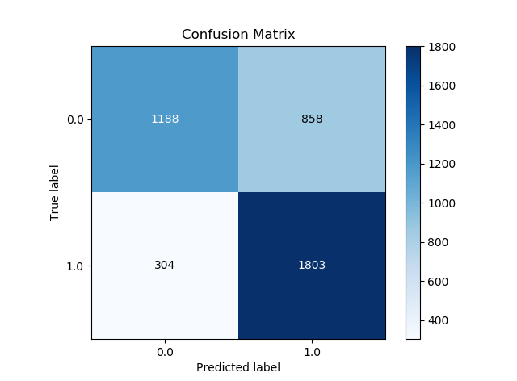
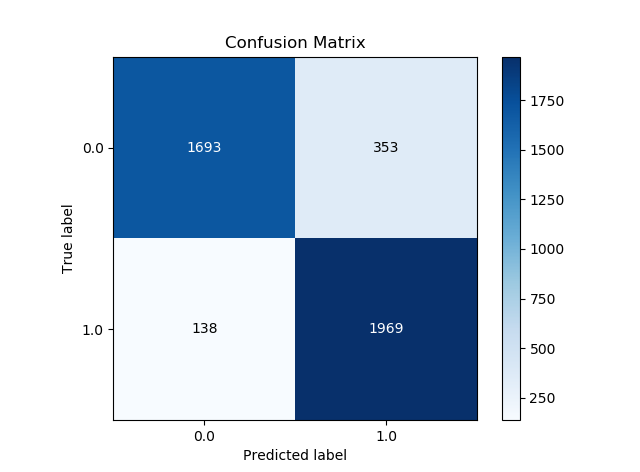
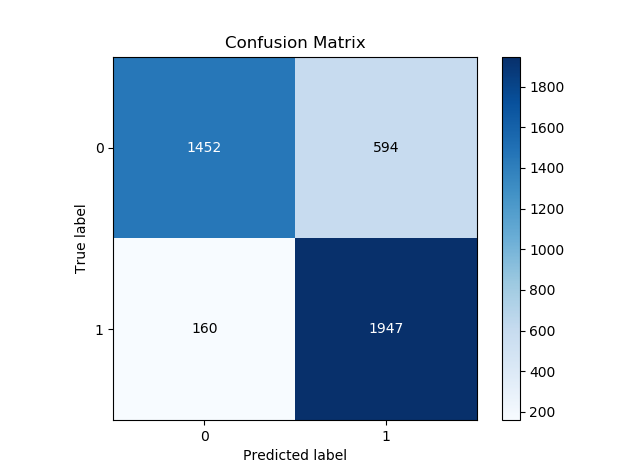
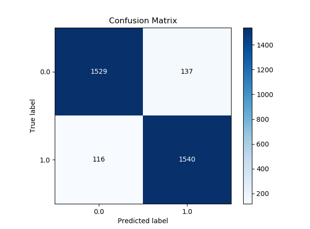
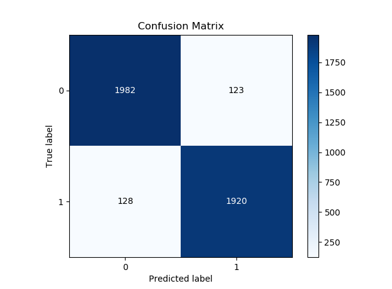

## File Structure
The file structure is the following

```
.
|
+-- datasets
|   +-- train.csv
|   +-- test.csv
+-- images
|   +-- svm-cm.png
|   +-- naive-bayes-cm.png
|   +-- neural-net-tf.png
|   +-- neural-net-keras.png
|   +-- lstm-cm.png
+-- *.py
```

## Try It Out

1. Clone the repo to your local machine-  
`> git clone git://github.com/FakeNewsDetection/FakeBuster.git`  
`> cd FakeBuster`

2. Make sure you have all the dependencies installed-  
 * python 3.6+
 * numpy
 * tensorflow
 * gensim
 * pandas
 * keras
 * matplotlib
 * scikitplot
 * sklearn
 * nltk
   * For nltk, we recommend typing `python.exe` in your command line which will take you to the Python interpretor.  
     * Then, enter-
       * `>>> import nltk`
       * `>>> nltk.download()`
    
3. You're good to go now-  
`> python svm.py`

## Comparing Accuracies of Models

| Model                     | Accuracy     |
|:-------------------------:|:------------:|
| Naive Bayes               | 72.94%       |
| SVM                       | 88.42%       |
| Neural Network with TF    | 81.42%       |
| Neural Network with Keras | 92.62%       |
| LSTM                      | 94.53%       |

## Confusion Matrices

* Naive Bayes



* SVM



* Neural Network with TensorFlow



* Neural Network with Keras



* LSTM



